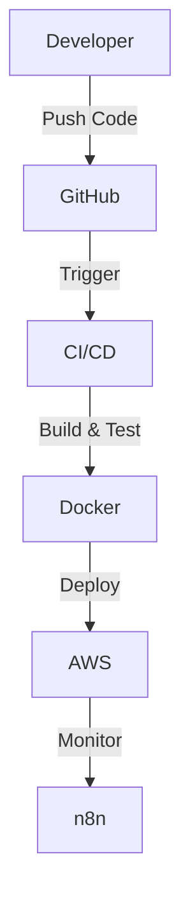

# 👋 Hi there, I'm Tehseen Nayeem Khan

🌩️ **Cloud Enthusiast** | ⚙️ **DevOps Learner** | 🧩 **Automation Explorer**

---

## 📖 About Me

Hi! I’m Tehseen—a passionate cloud enthusiast, DevOps learner, and problem solver who loves building, automating, and scaling infrastructure using modern tools. Whether deploying apps with Docker, orchestrating Kubernetes clusters, or creating smart AI workflows, I’m always exploring new technologies and finding creative solutions.

Outside tech, you’ll find me playing cricket, tinkering with automations, or chasing the next big idea.

---

## 🧰 Tech Stack & Tools

| Category | Tools |
|-----------|-------|
| **Containerization** | 🐳 Docker, Kubernetes |
| **Cloud** | ☁️ AWS (EC2, EBS, S3, ECR, IAM) |
| **Infrastructure as Code (IaC)** | 🧱 Terraform |
| **CI/CD** | 🔄 Jenkins, GitHub Actions |
| **Automation & Workflow** | ⚙️ n8n, Bash scripting |
| **OS & Systems** | 🐧 Linux, Ubuntu |
| **Version Control** | 🧭 Git, GitHub |

---

## 🚀 Featured Projects

| Project | Description | Stack |
|----------|--------------|-------|
| 🐳 **Deploying an App using Docker & AWS EBS** | Containerized a web app and deployed it on AWS Elastic Beanstalk for scalable hosting | Docker, AWS, EBS |
| 🤖 **AI Workflow Automation using n8n** | Built an AI-driven workflow automation system connecting APIs and AI models with n8n | n8n, Node.js, APIs |
| ☸️ **Kubernetes Mini Lab** *(coming soon)* | Setting up a local K8s cluster using Minikube and deploying Nginx Ingress | Kubernetes, Helm |
| ⚙️ **CI/CD Pipeline Practice** *(in progress)* | Automating build, test, and deploy using GitHub Actions and Jenkins | Jenkins, GitHub Actions |

---

## 🧠 My DevOps Workflow (Visual)

---

## 🧩 Learning Journey

- 🧠 Deepening my knowledge in **Kubernetes deployments & Helm**
- ☁️ Exploring **AWS services for scalable deployments**
- 🧾 Practicing **CI/CD automation with Jenkins & GitHub Actions**
- 🔍 Learning **Infrastructure as Code with Terraform**

---

## 🌐 Connect with Me

- [LinkedIn](https://www.linkedin.com/in/tehseen-nayeem-khan-4b586b217)

---

*Always learning, building, and finding solutions—on the cloud and in life!*
